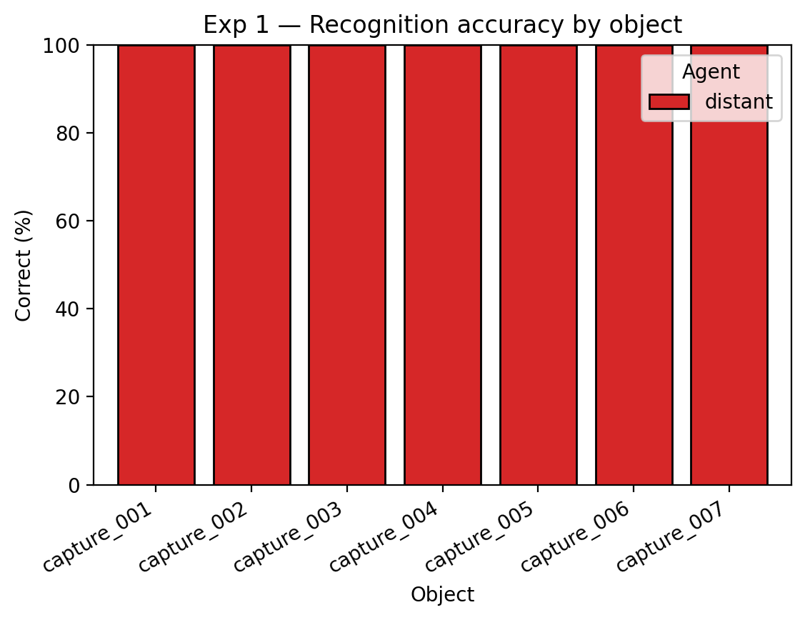
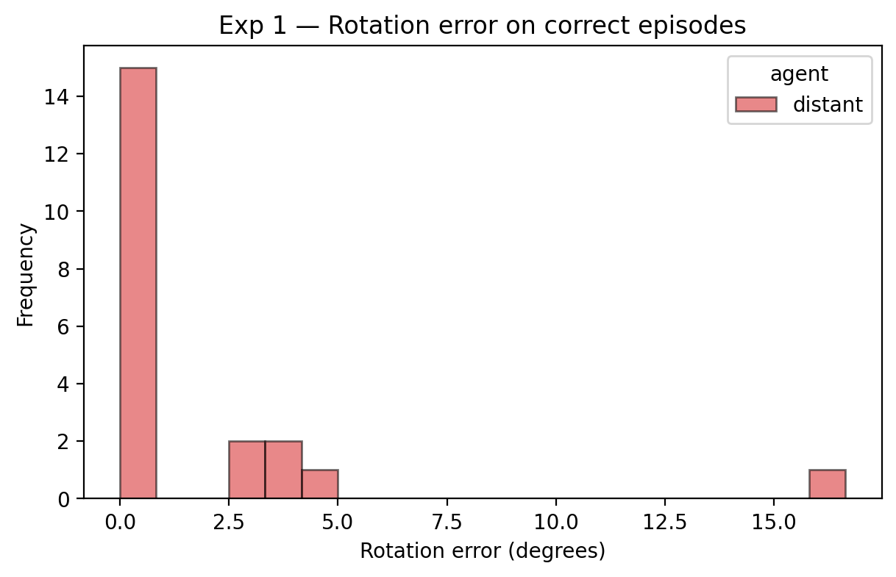
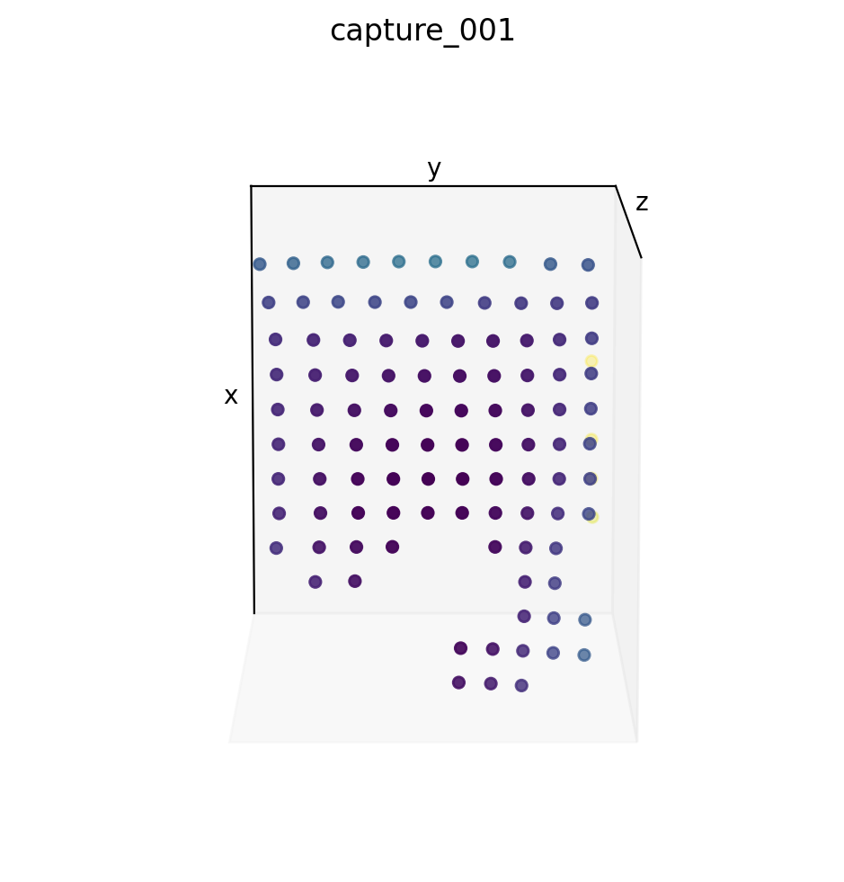
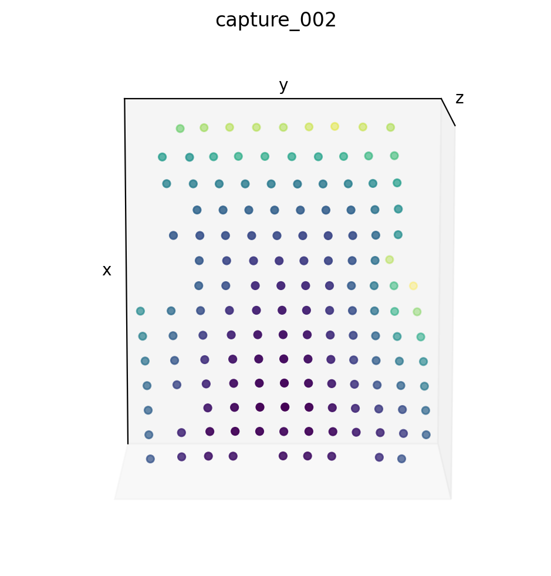
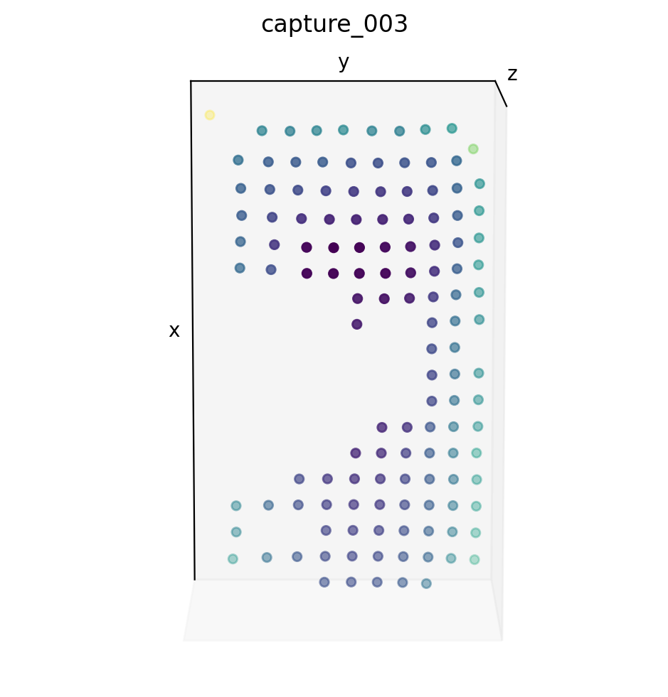
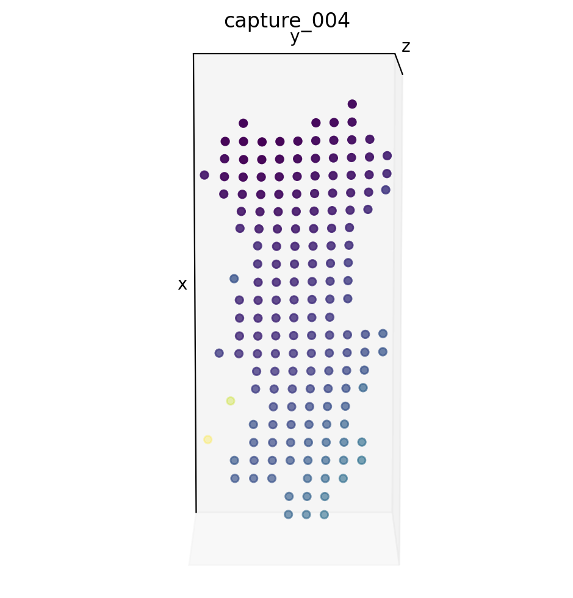
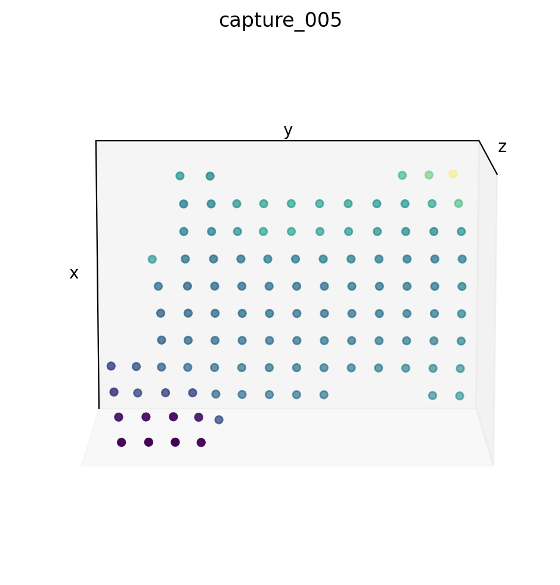
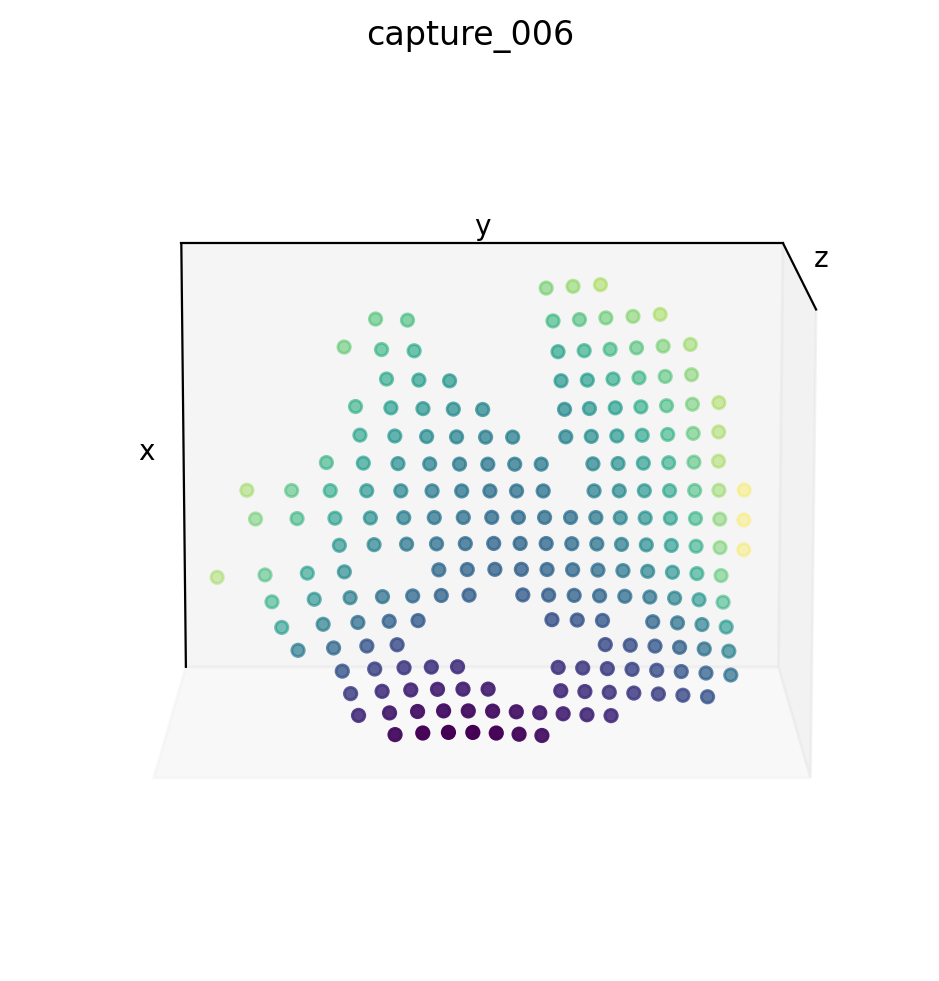
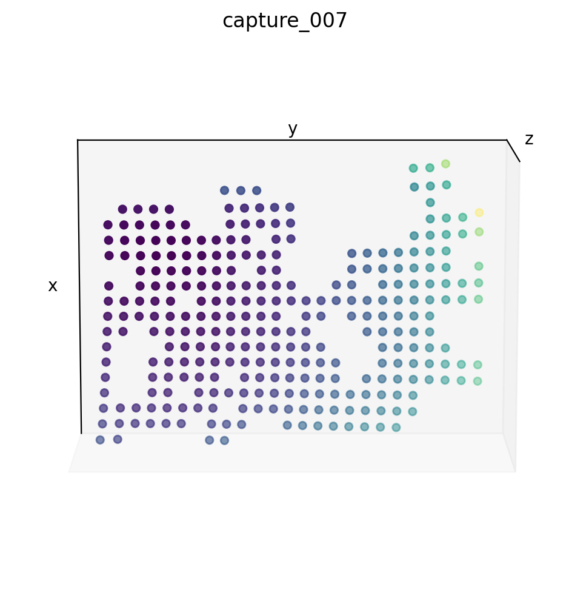

# Experiment 1 — Baseline Feasibility

### Overall distant-agent performance

| Correct (%) | Confused (%) | No Match (%) | Num Match Steps | Rotation Error (degrees) | Episode Run Time (s) | Num Episodes |
| --- | --- | --- | --- | --- | --- | --- |
| 100 | 0 | 0 | 109.6 | 1.7 | 4.78 | 21 |

### Per-object distant performance

| Object | Correct (%) | Confused (%) | No Match (%) | Num Match Steps | Rotation Error (degrees) | Episode Run Time (s) | Num Episodes |
| --- | --- | --- | --- | --- | --- | --- | --- |
| capture_001 | 100 | 0 | 0 | 61 | 0.1 | 1.91 | 3 |
| capture_002 | 100 | 0 | 0 | 61 | 0.1 | 2.44 | 3 |
| capture_003 | 100 | 0 | 0 | 104.7 | 1.9 | 4.78 | 3 |
| capture_004 | 100 | 0 | 0 | 86 | 2.5 | 3.38 | 3 |
| capture_005 | 100 | 0 | 0 | 61 | 0.1 | 2.87 | 3 |
| capture_006 | 100 | 0 | 0 | 108.7 | 5.6 | 4.82 | 3 |
| capture_007 | 100 | 0 | 0 | 284.7 | 1.4 | 13.26 | 3 |

See [per_object.md](per_object.md).

