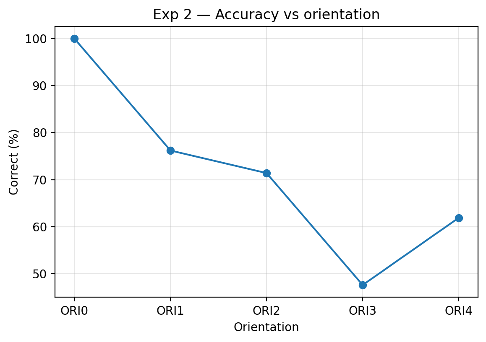
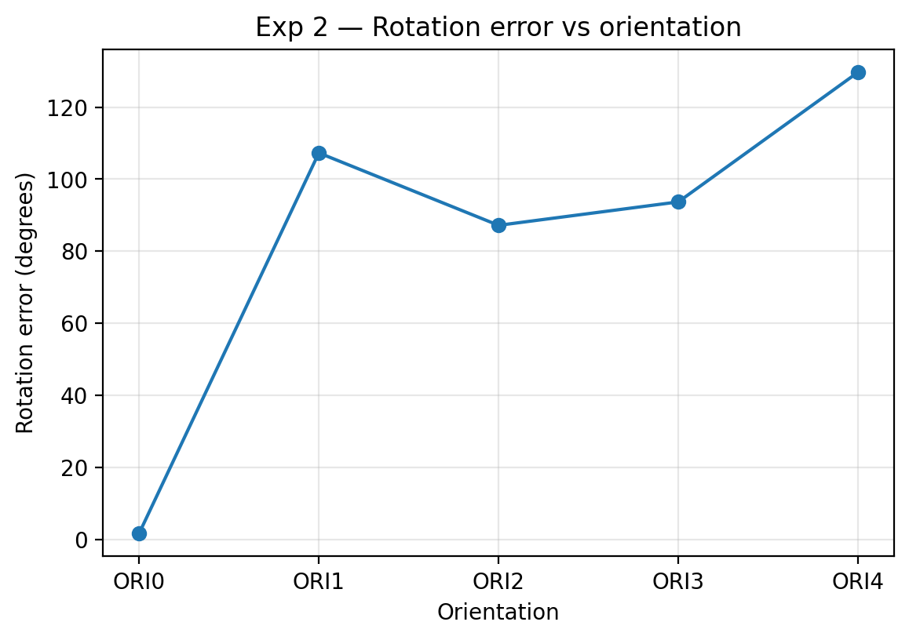

# Experiment 2 — Rotation Invariance

### Distant accuracy and rotation error by orientation

| Orientation | Correct (%) | Confused (%) | No Match (%) | Num Match Steps | Rotation Error (degrees) | Episode Run Time (s) | Num Episodes |
| --- | --- | --- | --- | --- | --- | --- | --- |
| ORI0 | 100 | 0 | 0 | 109.6 | 1.7 | 4.78 | 21 |
| ORI1 | 76.2 | 23.8 | 0 | 491.2 | 107.3 | 23.64 | 21 |
| ORI2 | 71.4 | 28.6 | 0 | 500 | 87.2 | 24.12 | 21 |
| ORI3 | 47.6 | 52.4 | 0 | 500 | 93.7 | 24.04 | 21 |
| ORI4 | 61.9 | 38.1 | 0 | 500 | 129.7 | 24.29 | 21 |

