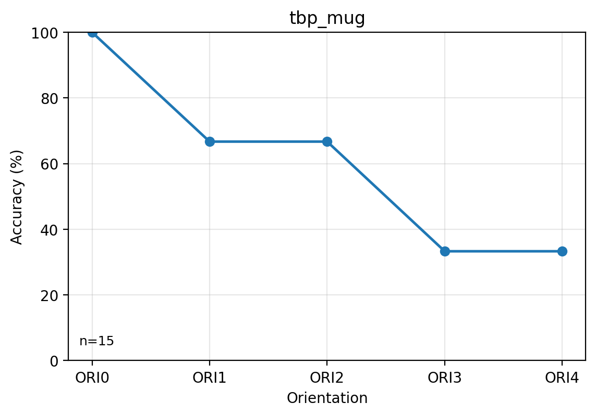
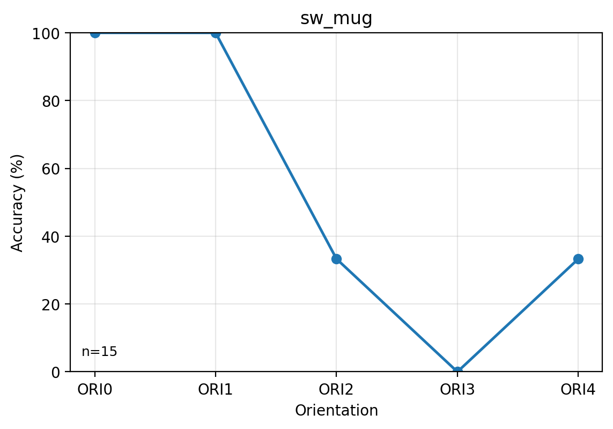
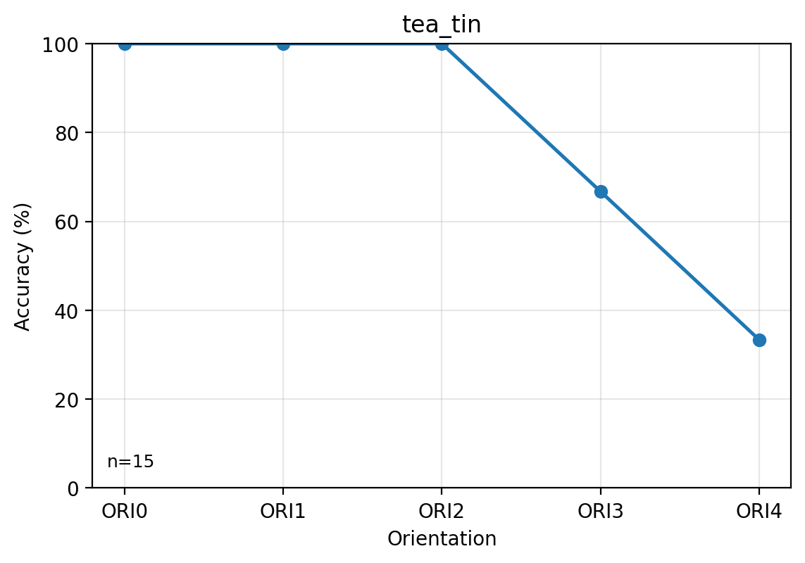
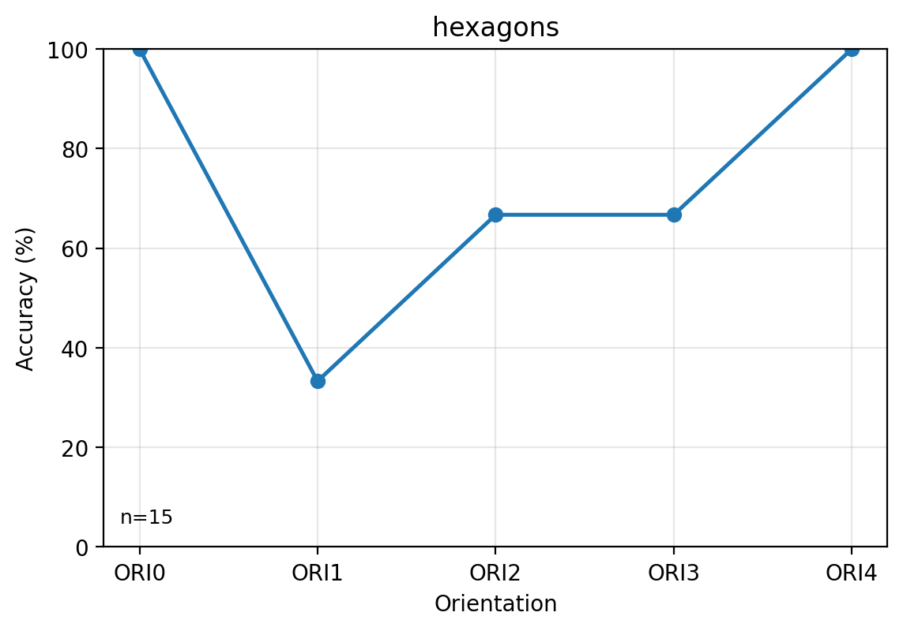
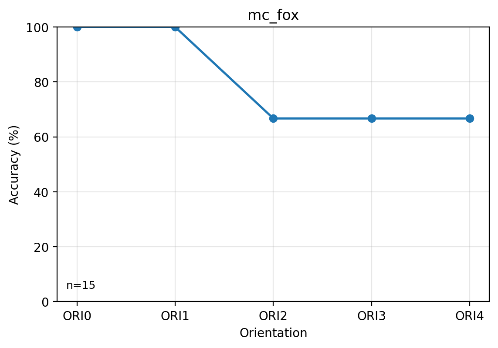
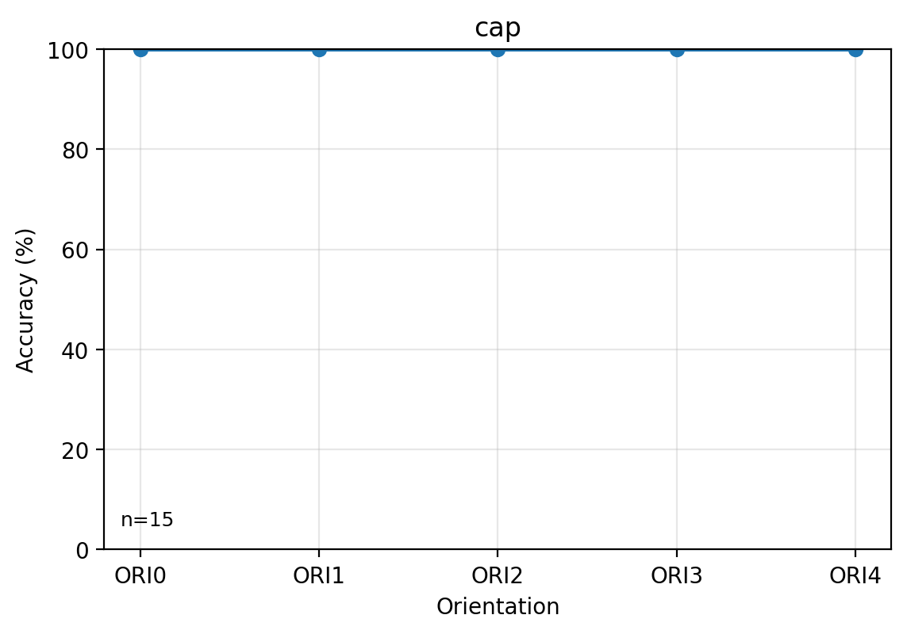
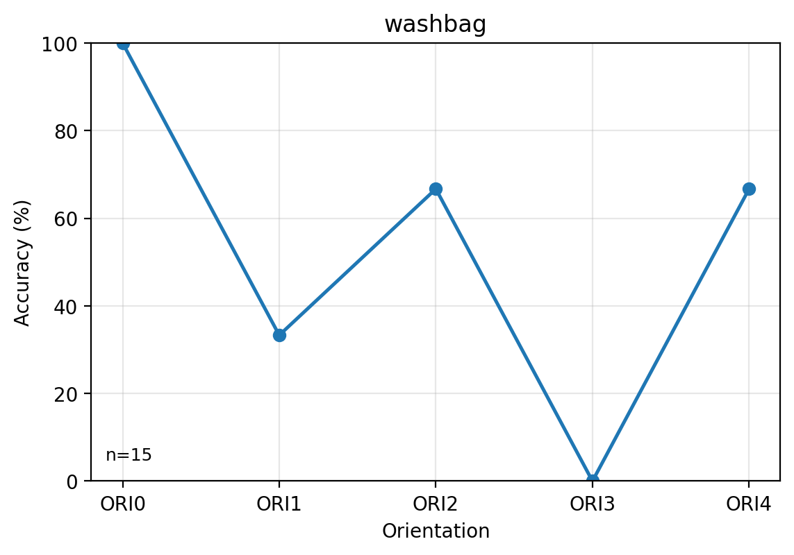

# Experiment 2 — Rotation Invariance by Object

Accuracy is episode-level accuracy from `primary_performance` in {correct, correct_mlh}. Object IDs use the same capture-to-object mapping as exp1.

### Per-object accuracy by orientation

| Object | Object ID | Orientation | Correct episodes | Num episodes | Accuracy (%) |
| --- | --- | --- | --- | --- | --- |
| tbp_mug | capture_001 | ORI0 | 3 | 3 | 100 |
| tbp_mug | capture_001 | ORI1 | 2 | 3 | 66.7 |
| tbp_mug | capture_001 | ORI2 | 2 | 3 | 66.7 |
| tbp_mug | capture_001 | ORI3 | 1 | 3 | 33.3 |
| tbp_mug | capture_001 | ORI4 | 1 | 3 | 33.3 |
| sw_mug | capture_002 | ORI0 | 3 | 3 | 100 |
| sw_mug | capture_002 | ORI1 | 3 | 3 | 100 |
| sw_mug | capture_002 | ORI2 | 1 | 3 | 33.3 |
| sw_mug | capture_002 | ORI3 | 0 | 3 | 0 |
| sw_mug | capture_002 | ORI4 | 1 | 3 | 33.3 |
| tea_tin | capture_003 | ORI0 | 3 | 3 | 100 |
| tea_tin | capture_003 | ORI1 | 3 | 3 | 100 |
| tea_tin | capture_003 | ORI2 | 3 | 3 | 100 |
| tea_tin | capture_003 | ORI3 | 2 | 3 | 66.7 |
| tea_tin | capture_003 | ORI4 | 1 | 3 | 33.3 |
| hexagons | capture_004 | ORI0 | 3 | 3 | 100 |
| hexagons | capture_004 | ORI1 | 1 | 3 | 33.3 |
| hexagons | capture_004 | ORI2 | 2 | 3 | 66.7 |
| hexagons | capture_004 | ORI3 | 2 | 3 | 66.7 |
| hexagons | capture_004 | ORI4 | 3 | 3 | 100 |
| mc_fox | capture_005 | ORI0 | 3 | 3 | 100 |
| mc_fox | capture_005 | ORI1 | 3 | 3 | 100 |
| mc_fox | capture_005 | ORI2 | 2 | 3 | 66.7 |
| mc_fox | capture_005 | ORI3 | 2 | 3 | 66.7 |
| mc_fox | capture_005 | ORI4 | 2 | 3 | 66.7 |
| cap | capture_006 | ORI0 | 3 | 3 | 100 |
| cap | capture_006 | ORI1 | 3 | 3 | 100 |
| cap | capture_006 | ORI2 | 3 | 3 | 100 |
| cap | capture_006 | ORI3 | 3 | 3 | 100 |
| cap | capture_006 | ORI4 | 3 | 3 | 100 |
| washbag | capture_007 | ORI0 | 3 | 3 | 100 |
| washbag | capture_007 | ORI1 | 1 | 3 | 33.3 |
| washbag | capture_007 | ORI2 | 2 | 3 | 66.7 |
| washbag | capture_007 | ORI3 | 0 | 3 | 0 |
| washbag | capture_007 | ORI4 | 2 | 3 | 66.7 |

### tbp_mug

### sw_mug

### tea_tin

### hexagons

### mc_fox

### cap

### washbag

