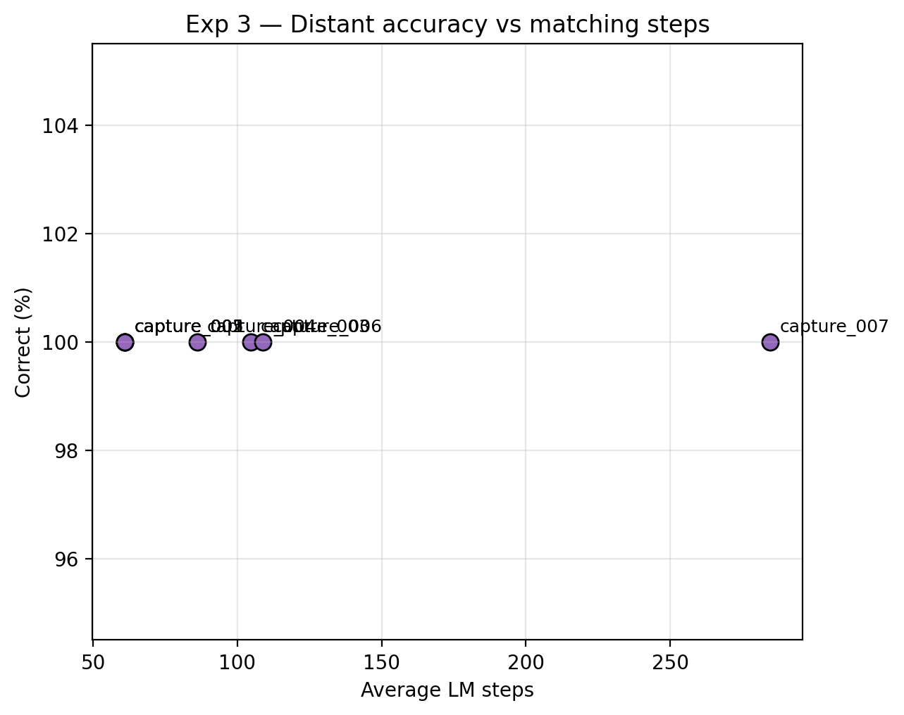

# Experiment 3 — Modality Discussion

### Distant per-object performance

| Object | Correct (%) | Num Match Steps | Episode Run Time (s) |
| --- | --- | --- | --- |
| capture_001 | 100 | 61 | 1.91 |
| capture_002 | 100 | 61 | 2.44 |
| capture_003 | 100 | 104.7 | 4.78 |
| capture_004 | 100 | 86 | 3.38 |
| capture_005 | 100 | 61 | 2.87 |
| capture_006 | 100 | 108.7 | 4.82 |
| capture_007 | 100 | 284.7 | 13.26 |

## Surface note

washbag: bbox-volume spread 3342831.3 mm^3, point-count spread 15. CBOX: bbox-volume spread 16222.6 mm^3, point-count spread 7. MCFOX: bbox-volume spread 0.0 mm^3, point-count spread 0. CAP: bbox-volume spread 0.0 mm^3, point-count spread 0.

