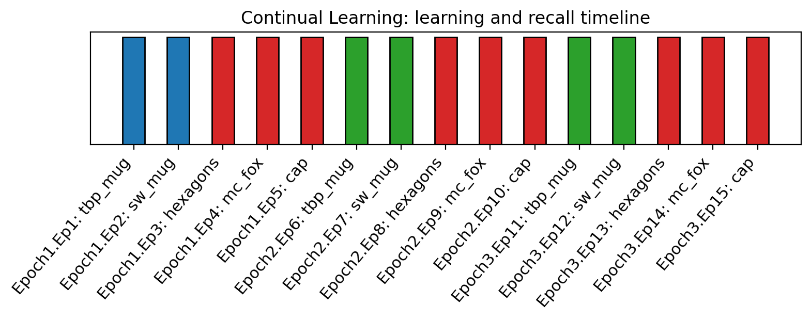

# Experiment 4 — Continual Learning

### Episode-by-episode continual learning

| Episode | Epoch | Object | Episode Type | Recall Outcome | New Graph? | Predicted | TFNP | Time (s) |
| --- | --- | --- | --- | --- | --- | --- | --- | --- |
| 1 | 1 | tbp_mug | learn | learn | Yes | new_object0 | TN | 0 |
| 2 | 1 | sw_mug | learn | learn | Yes | new_object0 | TN | 0 |
| 3 | 1 | hexagons | learn | miss | No | new_object1 | FP | 6.97 |
| 4 | 1 | mc_fox | learn | miss | No | new_object1 | FP | 6.98 |
| 5 | 1 | cap | learn | miss | No | new_object1 | FP | 6.76 |
| 6 | 2 | tbp_mug | recall | hit |  | new_object0 | TP | 1.96 |
| 7 | 2 | sw_mug | recall | hit |  | new_object1 | TP | 0.64 |
| 8 | 2 | hexagons | recall | miss |  | new_object0 | FP | 7.35 |
| 9 | 2 | mc_fox | recall | miss |  | new_object0 | FP | 7.03 |
| 10 | 2 | cap | recall | miss |  | new_object0 | FP | 7.25 |
| 11 | 3 | tbp_mug | recall | hit |  | new_object0 | TP | 0.62 |
| 12 | 3 | sw_mug | recall | hit |  | new_object1 | TP | 0.66 |
| 13 | 3 | hexagons | recall | miss |  | new_object0 | FP | 7.11 |
| 14 | 3 | mc_fox | recall | miss |  | new_object1 | FP | 7.07 |
| 15 | 3 | cap | recall | miss |  | new_object1 | FP | 7.49 |

### Summary

- New graphs seeded: **2 / 5** first-occurrence episodes (3 first-occurrence targets were collapsed onto an existing graph rather than seeded as new).
- Recall accuracy (epochs ≥2): **4 / 10 = 40%**.

