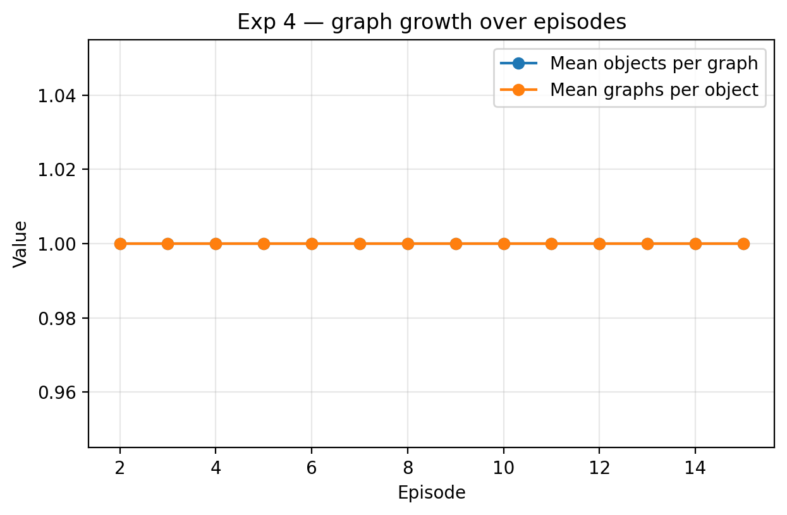

# Experiment 4 — Continual Learning

### Episode-by-episode continual learning

| Episode | Epoch | Object | Episode Type | Recall | Predicted | Mean Objects Per Graph | Mean Graphs Per Object | Time (s) |
| --- | --- | --- | --- | --- | --- | --- | --- | --- |
| 1 | 1 | capture_001 | learn |  | new_object0 |  |  | 0 |
| 2 | 1 | capture_002 | learn |  | new_object0 | 1 | 1 | 0 |
| 3 | 1 | capture_004 | learn |  | new_object1 | 1 | 1 | 6.97 |
| 4 | 1 | capture_005 | learn |  | new_object1 | 1 | 1 | 6.98 |
| 5 | 1 | capture_006 | learn |  | new_object1 | 1 | 1 | 6.76 |
| 6 | 2 | capture_001 | recall | hit | new_object0 | 1 | 1 | 1.96 |
| 7 | 2 | capture_002 | recall | hit | new_object1 | 1 | 1 | 0.64 |
| 8 | 2 | capture_004 | recall | miss | new_object0 | 1 | 1 | 7.35 |
| 9 | 2 | capture_005 | recall | miss | new_object0 | 1 | 1 | 7.03 |
| 10 | 2 | capture_006 | recall | miss | new_object0 | 1 | 1 | 7.25 |
| 11 | 3 | capture_001 | recall | hit | new_object0 | 1 | 1 | 0.62 |
| 12 | 3 | capture_002 | recall | hit | new_object1 | 1 | 1 | 0.66 |
| 13 | 3 | capture_004 | recall | miss | new_object0 | 1 | 1 | 7.11 |
| 14 | 3 | capture_005 | recall | hit | new_object1 | 1 | 1 | 7.07 |
| 15 | 3 | capture_006 | recall | hit | new_object1 | 1 | 1 | 7.49 |

