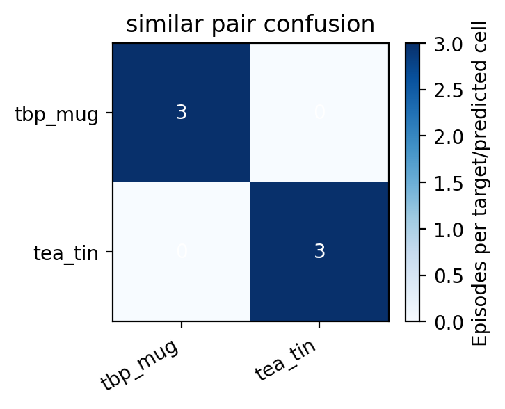

# Experiment 6 — Similar Object Discrimination

### Distant confusion counts

| Predicted → Actual ↓ | `tbp_mug` (capture_001) | `tea_tin` (capture_003) |
|---|---|---|
| `tbp_mug` | **3** | 0 |
| `tea_tin` | 0 | **3** |

