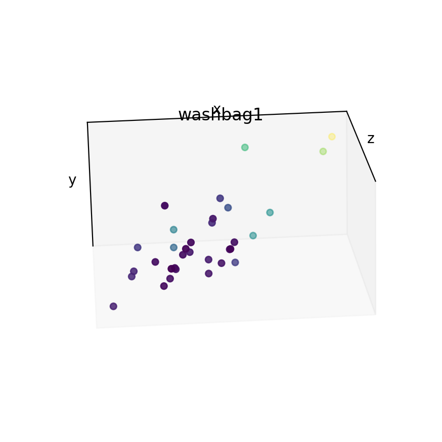
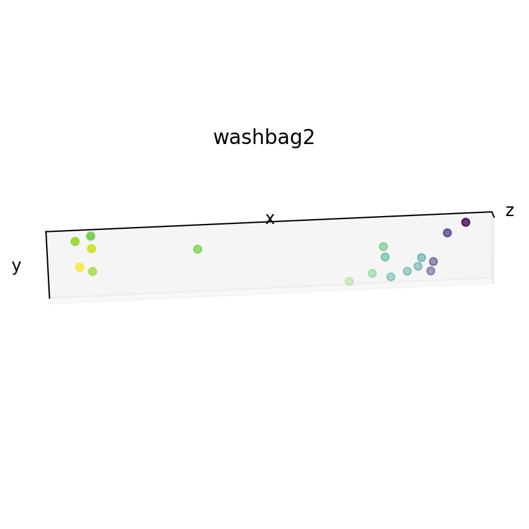
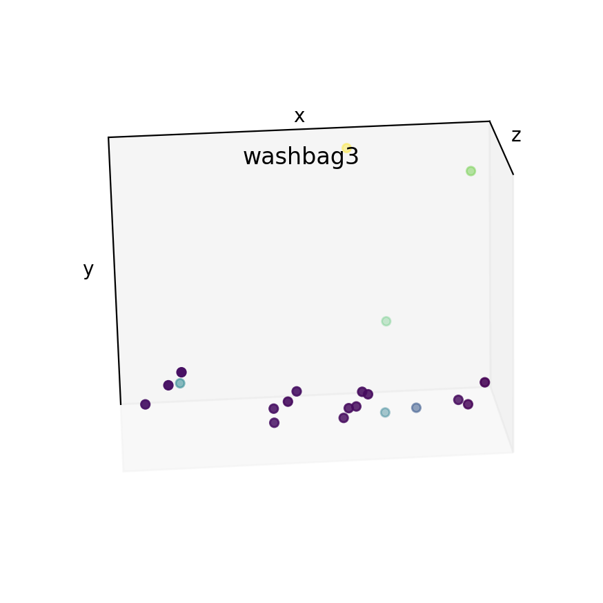
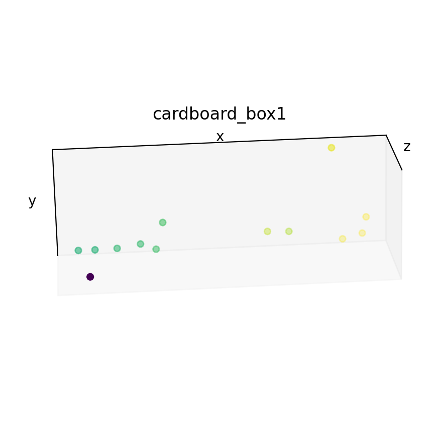
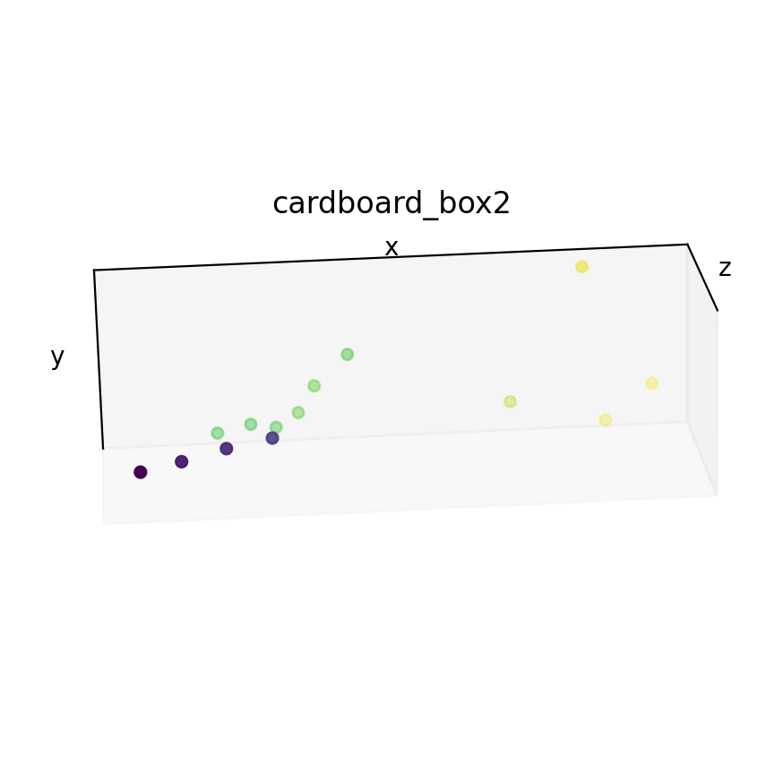
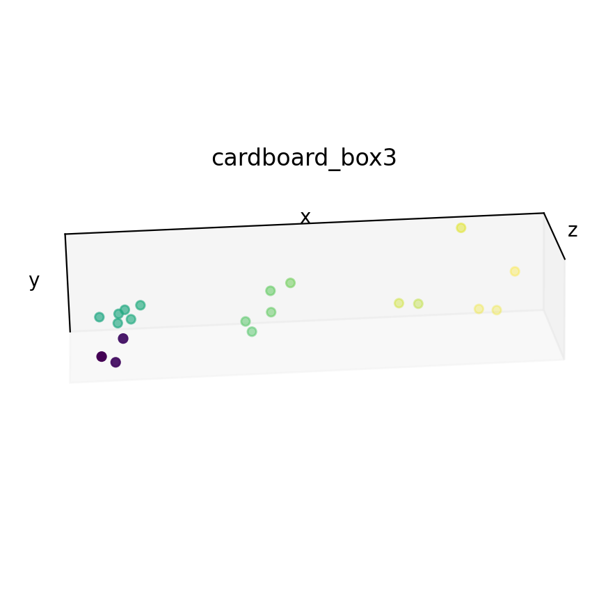
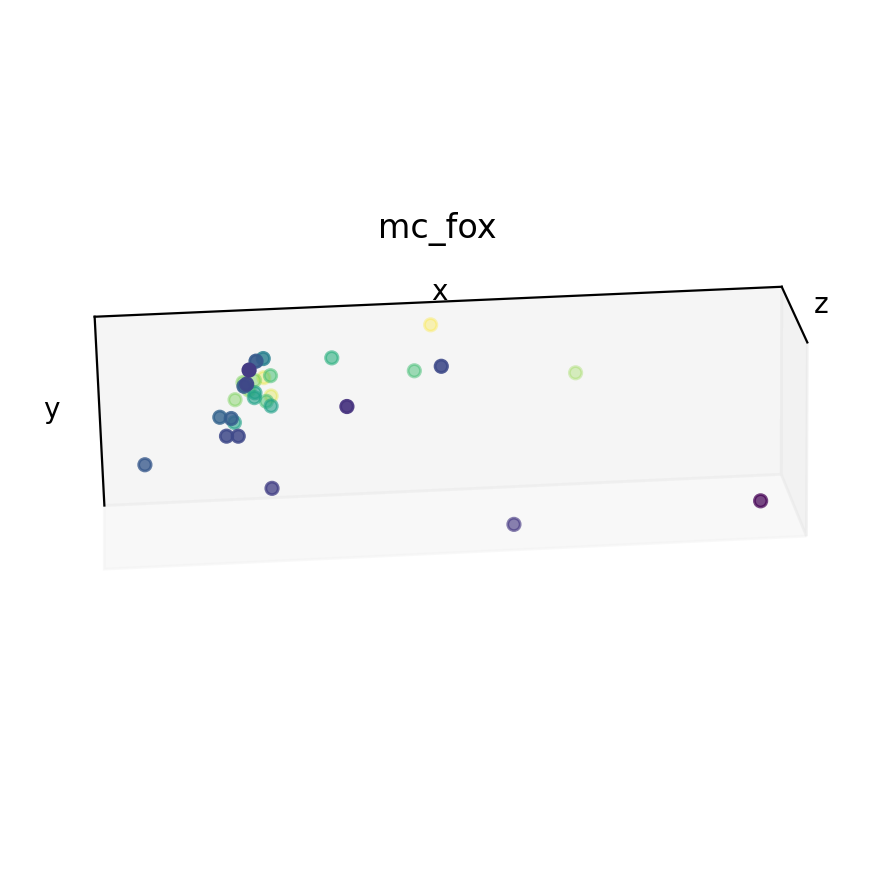
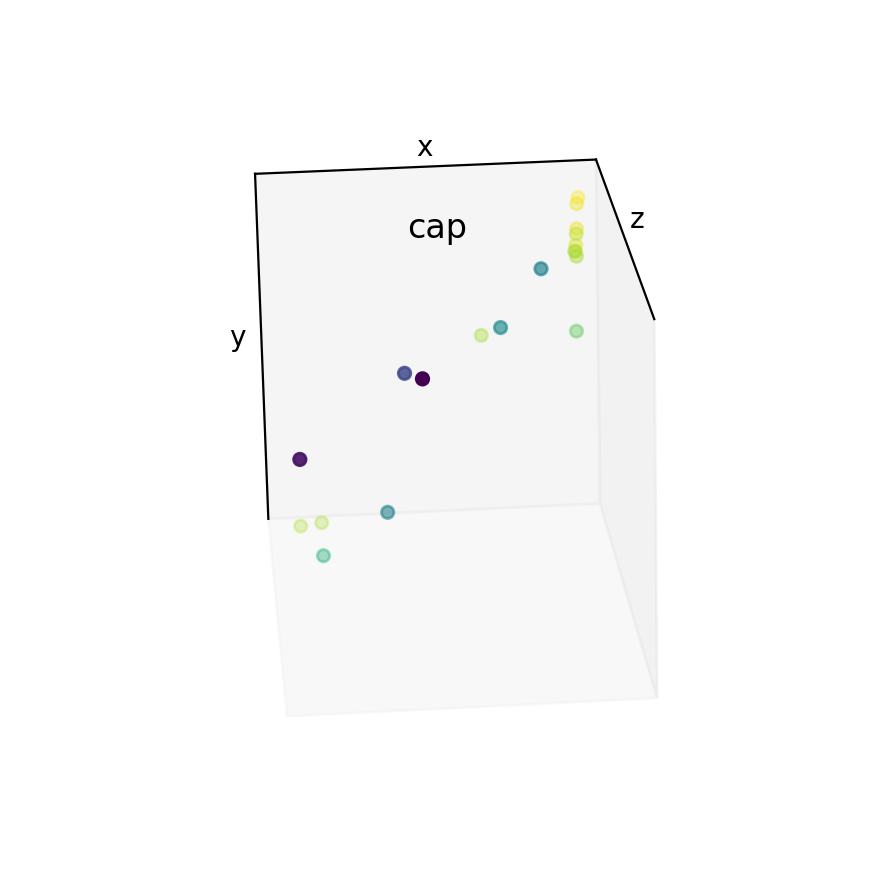
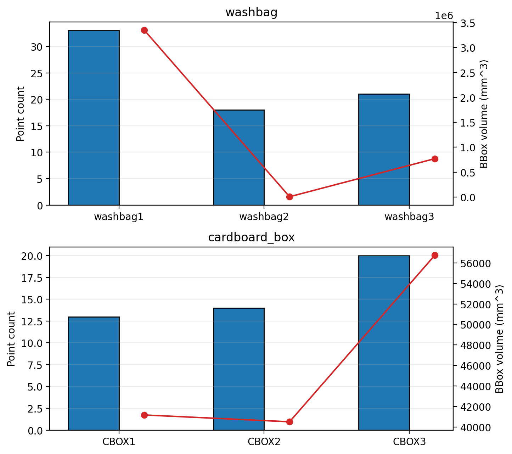

# Dissertation Analysis Index

Auto-generated by `python -m tools.dissertation_analysis`.

## Surface Agent — Training Feasibility and Limitations
See [surface_unsupervised/summary.md](surface_unsupervised/summary.md).

